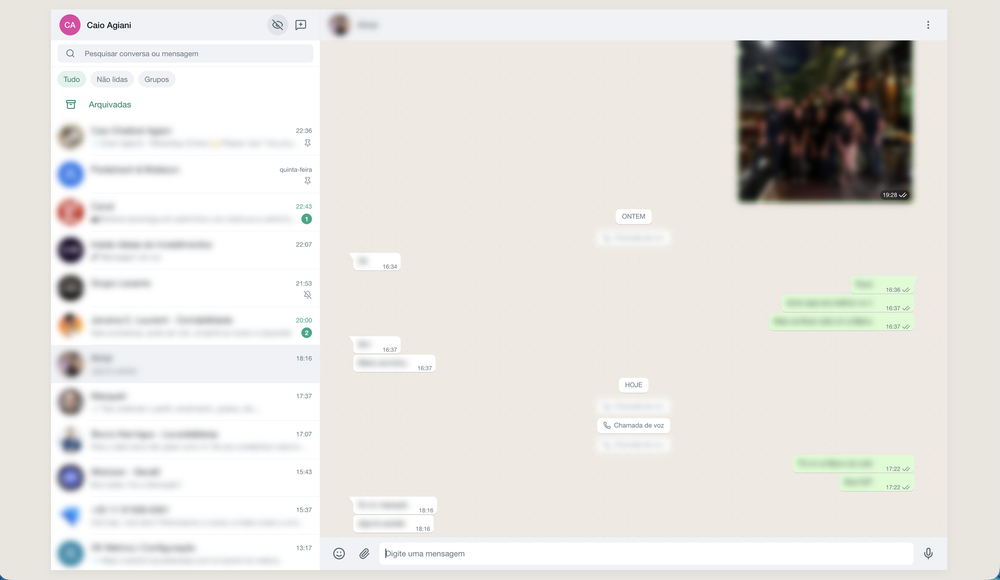

<p align="center">
  
</p>

<h1 align="center">WhatsApp Bot</h1>

<p align="center">
  <strong>WhatsApp bot in TypeScript with a web interface, REST API and command system.</strong>
</p>

<p align="center">
  
  
  
</p>

<p align="center">
  
</p>

## Features

- 💻 **Web interface** — WhatsApp Web–style UI: chats and groups, emoji, images, video, documents, voice notes, replies, read receipts, full-text search, dark mode, mobile layout and a privacy blur (`Ctrl+Shift+X`).
- 🗄️ **Local history** — messages are synced to SQLite from WhatsApp events, so the UI is fast, paginated and still browsable when WhatsApp is offline.
- ⚡ **Realtime** — new messages, acks and chat updates pushed over WebSocket.
- 🌐 **REST API** — send messages and query chats, contacts and groups.
- 🤖 **Commands** — extensible `!command` system (currency, CEP, profile pic, mention all, SMS).

## Quick start

Requires Node.js 22+.

```bash
git clone git@github.com:caioagiani/whatsapp-bot.git && cd whatsapp-bot
npm install
cp .env.example .env

npm run web:install && npm run web:build   # build the interface
npm run dev                                # bot + API + UI on http://localhost:3000
```

Open `http://localhost:3000`, scan the QR code (**WhatsApp → Linked devices → Link a device**) and the chats sync automatically. The session is saved, so restarts reconnect without a new QR.

For frontend work, `npm run web:dev` starts Vite with hot reload on `:5173`.

## Commands

| Command | Aliases | Description |
|---------|---------|-------------|
| `!help` | `!ajuda`, `!comandos` | List commands |
| `!cotacao` | `!moeda`, `!dolar`, `!bitcoin` | USD, EUR and BTC rates |
| `!cep <code>` | | Brazilian postal code lookup |
| `!perfil @user` | `!foto`, `!avatar` | Profile picture |
| `!mencionar` | `!everyone`, `!todos` | Mention all group members (admin) |
| `!sms @user` | | Send an SMS (Mobizon) |

## API

```bash
curl localhost:3000/api/status
curl 'localhost:3000/api/chats?filter=unread'
curl -X POST localhost:3000/api/chats/5511999999999@c.us/messages \
  -H 'Content-Type: application/json' -d '{"text": "Hello!"}'
```

Set `API_KEY` to require `Authorization: Bearer <key>`. Full reference: [docs/API.md](docs/API.md).

## Configuration

| Variable | Default | Description |
|----------|---------|-------------|
| `API_PORT` | `3000` | HTTP / UI port |
| `API_KEY` | — | Enables API auth |
| `BOT_OWNER_PHONE` | — | Receives a message when the bot connects |
| `SYNC_BACKFILL_CHATS` / `SYNC_BACKFILL_MESSAGES` | `30` / `50` | History fetched on connect |
| `DB_PATH` / `MEDIA_DIR` | `src/data/…` | Local store and media cache |
| `MOBIZON_API_KEY` | — | Required for `!sms` |

Admins for restricted commands go in `src/config/integrantes.json` (gitignored).

## Development

```bash
npm test          # Jest + Supertest
npm run lint
npm run db:generate   # after editing src/db/schema.ts
```

How it works (sync, storage, commands): [docs/ARCHITECTURE.md](docs/ARCHITECTURE.md). Contributions welcome — use [Conventional Commits](https://www.conventionalcommits.org/).

## License

[GNU AGPL](./LICENSE) © 2022-2026 [Caio Agiani](https://github.com/caioagiani).

Not affiliated with WhatsApp. Use responsibly and within WhatsApp's Terms of Service. Built on [whatsapp-web.js](https://github.com/wwebjs/whatsapp-web.js).
