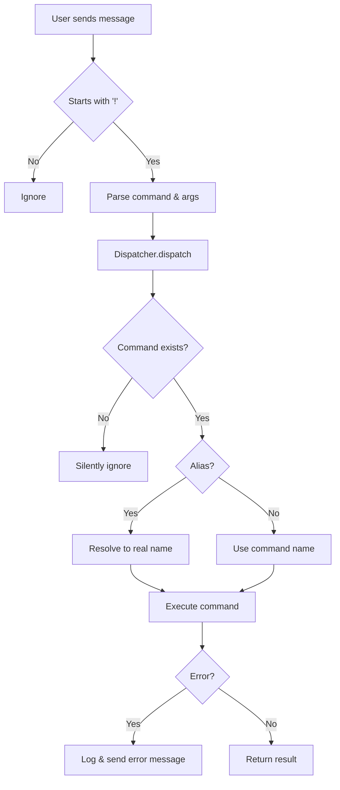

# Architecture Documentation

## Table of Contents

- [Overview](#overview)
- [Design Principles](#design-principles)
- [Core Components](#core-components)
- [Command System](#command-system)
- [Data Flow](#data-flow)
- [Error Handling](#error-handling)
- [Extension Points](#extension-points)
- [Best Practices](#best-practices)

---

## Overview

This WhatsApp bot is built using a **modern, interface-based architecture** that emphasizes:

- **Separation of Concerns** - Clear boundaries between components
- **Open/Closed Principle** - Open for extension, closed for modification
- **Dependency Inversion** - Depend on abstractions, not concretions
- **Single Responsibility** - Each class has one reason to change
- **Type Safety** - Full TypeScript implementation

### Technology Stack

| Technology | Purpose | Version |
|------------|---------|---------|
| **TypeScript** | Type-safe JavaScript | 4.7.4 |
| **whatsapp-web.js** | WhatsApp Web API | 1.17.1+ |
| **Puppeteer** | Browser automation | 18.2.1+ |
| **Node.js** | Runtime environment | 16+ |
| **Axios** | HTTP client | 0.27.0+ |

---

## Design Principles

### 1. Interface-Based Design

All commands implement the `ICommand` interface, ensuring consistency:

```typescript
interface ICommand {
  name: string;
  description: string;
  aliases?: string[];
  execute(message: Message, args: string[]): Promise<Message | void>;
}
```

**Benefits:**
- ✅ Compile-time type checking
- ✅ Contract enforcement
- ✅ Easy to mock for testing
- ✅ Clear API boundaries

### 2. Command Pattern

Commands are self-contained units that encapsulate:
- **What** they do (name, description)
- **How** to invoke them (aliases)
- **Implementation** (execute method)

### 3. Template Method Pattern

`BaseCommand` provides a template with common operations:

```typescript
abstract class BaseCommand implements ICommand {
  // Template methods
  protected async sendTyping(message: Message): Promise<void>
  protected async requireGroup(message: Message): Promise<Message | null>
  protected validateArgs(...): Message | null
  
  // Abstract method to be implemented
  abstract execute(message: Message, args: string[]): Promise<Message | void>
}
```

### 4. Registry Pattern

`CommandDispatcher` acts as a registry for all commands:

```typescript
class CommandDispatcher {
  private commands: Map<string, ICommand>
  private aliases: Map<string, string>
  
  register(command: ICommand): void
  dispatch(name: string, message: Message, args: string[]): Promise<void>
}
```

---

## Core Components

### 1. ICommand Interface

**Location:** `src/app/interfaces/ICommand.ts`

The foundation of the command system. Every command must implement this interface.

```typescript
export interface ICommand {
  /**
   * Unique command name (without ! prefix)
   * Example: 'cotacao', 'cep', 'perfil'
   */
  name: string;

  /**
   * Human-readable description for help text
   */
  description: string;

  /**
   * Alternative names for the command
   * Example: ['moeda', 'dolar'] for 'cotacao'
   */
  aliases?: string[];

  /**
   * Execute the command
   * @param message - WhatsApp message that triggered the command
   * @param args - Arguments passed after command name
   */
  execute(message: Message, args: string[]): Promise<Message | void>;
}
```

### 2. BaseCommand Abstract Class

**Location:** `src/app/utils/BaseCommand.ts`

Provides common functionality for all commands.

#### Helper Methods

| Method | Description | Return Type |
|--------|-------------|-------------|
| `sendTyping(message)` | Shows "typing..." indicator | `Promise<void>` |
| `isGroup(message)` | Checks if message is from group | `Promise<boolean>` |
| `getChat(message)` | Gets the chat object | `Promise<Chat>` |
| `requireGroup(message)` | Validates group-only command | `Promise<Message \| null>` |
| `validateArgs(...)` | Validates argument count | `Message \| null` |

#### Usage Example

```typescript
export class MyCommand extends BaseCommand {
  name = 'mycommand';
  description = 'My custom command';
  
  async execute(message: Message, args: string[]): Promise<Message> {
    // Use helper methods
    await this.sendTyping(message);
    
    const groupError = await this.requireGroup(message);
    if (groupError) return groupError;
    
    // Your logic here
    return message.reply('Success!');
  }
}
```

### 3. CommandDispatcher

**Location:** `src/app/utils/CommandDispatcher.ts`

Manages command registration and execution.

#### Internal Structure

```typescript
class CommandDispatcher {
  // Primary storage: command name -> command instance
  private commands: Map<string, ICommand> = new Map();
  
  // Alias resolution: alias -> command name
  private aliases: Map<string, string> = new Map();
}
```

#### Key Methods

**`register(command: ICommand): void`**

Registers a command and its aliases.

```typescript
register(command: ICommand): void {
  this.commands.set(command.name, command);
  
  if (command.aliases) {
    command.aliases.forEach(alias => {
      this.aliases.set(alias, command.name);
    });
  }
}
```

**`dispatch(commandName: string, message: Message, args: string[]): Promise<void>`**

Executes a command by name or alias.

```typescript
async dispatch(commandName: string, message: Message, args: string[]): Promise<void> {
  // Resolve alias to actual command name
  const resolvedName = this.aliases.get(commandName) || commandName;
  const command = this.commands.get(resolvedName);
  
  if (command) {
    try {
      await command.execute(message, args);
    } catch (error) {
      console.error(`Error executing command '${resolvedName}':`, error);
      await message.reply('⚠️ An error occurred while executing the command.');
    }
  }
  // If command doesn't exist, silently ignore
}
```

**`getCommand(name: string): ICommand | undefined`**

Retrieves a command by name or alias.

**`getAllCommands(): ICommand[]`**

Returns all registered commands (useful for help command).

**`hasCommand(name: string): boolean`**

Checks if a command exists.

### 4. Command Handler

**Location:** `src/app/commands/index.ts`

Entry point for all incoming messages.

#### Initialization

```typescript
export const initializeCommands = (): void => {
  commandDispatcher.register(new EconomyCommand());
  commandDispatcher.register(new QuoteCommand());
  commandDispatcher.register(new CepCommand());
  commandDispatcher.register(new ProfileCommand());
  commandDispatcher.register(new SmsCommand());
  
  console.log(`✅ ${commandDispatcher.getAllCommands().length} commands registered`);
};

// Auto-initialize when module loads
initializeCommands();
```

#### Message Processing

```typescript
export const CommandHandler = async (message: Message): Promise<void> => {
  // Ignore non-command messages
  if (!message.body.startsWith('!')) return;
  
  // Parse command and arguments
  const commandText = message.body.slice(1); // Remove '!'
  const [commandName, ...args] = commandText.split(' ');
  
  // Dispatch to appropriate command
  await commandDispatcher.dispatch(commandName.toLowerCase(), message, args);
};
```

---

## Command System

### Command Lifecycle



### Command Registration Flow

1. **Module Load** - `index.ts` is imported
2. **Auto-Initialize** - `initializeCommands()` is called
3. **Instantiation** - Each command class is instantiated
4. **Registration** - Commands are registered in dispatcher
5. **Alias Mapping** - Aliases are mapped to command names
6. **Ready** - Bot is ready to receive commands

### Command Execution Flow

1. **Message Received** - WhatsApp message arrives
2. **Prefix Check** - Verify message starts with `!`
3. **Parsing** - Extract command name and arguments
4. **Normalization** - Convert to lowercase
5. **Alias Resolution** - Resolve alias to actual command
6. **Validation** - Check if command exists
7. **Execution** - Call `command.execute(message, args)`
8. **Error Handling** - Catch and handle any errors
9. **Response** - Send result to user

---

## Data Flow

### Message Flow Diagram

```
┌─────────────┐
│   WhatsApp  │
│    User     │
└──────┬──────┘
       │ !cotacao
       ▼
┌─────────────────────────────────┐
│  WhatsApp Web Client (Puppeteer)│
└──────┬──────────────────────────┘
       │ message_create event
       ▼
┌─────────────────────────────────┐
│     CommandHandler              │
│  - Parse command                │
│  - Extract args                 │
└──────┬──────────────────────────┘
       │ dispatch('cotacao', msg, [])
       ▼
┌─────────────────────────────────┐
│   CommandDispatcher             │
│  - Resolve alias                │
│  - Find command                 │
└──────┬──────────────────────────┘
       │ execute(msg, [])
       ▼
┌─────────────────────────────────┐
│   EconomyCommand                │
│  - Validate                     │
│  - Fetch data                   │
│  - Format response              │
└──────┬──────────────────────────┘
       │ message.reply(...)
       ▼
┌─────────────────────────────────┐
│  WhatsApp Web Client            │
└──────┬──────────────────────────┘
       │
       ▼
┌─────────────┐
│   WhatsApp  │
│    User     │
└─────────────┘
```

### Argument Parsing

```typescript
// Input: "!cep 01310-100"
const commandText = "cep 01310-100";  // After removing '!'
const [commandName, ...args] = commandText.split(' ');

// Result:
// commandName = "cep"
// args = ["01310-100"]
```

```typescript
// Input: "!perfil @John Doe"
const commandText = "perfil @John Doe";
const [commandName, ...args] = commandText.split(' ');

// Result:
// commandName = "perfil"
// args = ["@John", "Doe"]
```

---

## Error Handling

### Layered Error Handling

The bot implements a **three-layer error handling strategy**:

#### Layer 1: Command-Level

Each command handles its own specific errors:

```typescript
async execute(message: Message, args: string[]): Promise<Message> {
  try {
    const { data } = await axios.get(apiUrl);
    return message.reply(formatData(data));
  } catch (error) {
    console.error('API error:', error);
    return message.reply('⚠️ Service unavailable. Try again later.');
  }
}
```

#### Layer 2: Dispatcher-Level

Dispatcher catches any unhandled errors:

```typescript
async dispatch(...): Promise<void> {
  if (command) {
    try {
      await command.execute(message, args);
    } catch (error) {
      console.error(`Error executing command '${resolvedName}':`, error);
      await message.reply('⚠️ An error occurred while executing the command.');
    }
  }
}
```

#### Layer 3: Validation-Level

BaseCommand provides validation helpers:

```typescript
// Group validation
const groupError = await this.requireGroup(message);
if (groupError) return groupError;

// Argument validation
const argError = this.validateArgs(message, args, 1, '!cep <code>');
if (argError) return argError;
```

### Error Message Guidelines

✅ **DO:**
- Use emoji for visual feedback (⚠️, ❌, ✅)
- Provide clear, actionable messages
- Include usage examples when appropriate
- Log errors to console for debugging

❌ **DON'T:**
- Expose technical details to users
- Use generic "Error" messages
- Crash the bot on errors
- Ignore errors silently (except for unknown commands)

---

## Extension Points

### Adding a New Command

**Step 1:** Create command file

```typescript
// src/app/commands/WeatherCommand.ts
import { BaseCommand } from '../utils/BaseCommand';
import type { Message } from 'whatsapp-web.js';
import axios from 'axios';

export class WeatherCommand extends BaseCommand {
  name = 'weather';
  description = 'Get weather information for a city';
  aliases = ['clima', 'tempo'];
  
  async execute(message: Message, args: string[]): Promise<Message> {
    await this.sendTyping(message);
    
    if (args.length === 0) {
      return message.reply('⚠️ Please provide a city name.\n\n📖 *Usage:* !weather London');
    }
    
    const city = args.join(' ');
    
    try {
      const { data } = await axios.get(`https://api.weather.com/${city}`);
      
      return message.reply(
        `🌤️ *Weather in ${city}*\n\n` +
        `Temperature: ${data.temp}°C\n` +
        `Condition: ${data.condition}\n` +
        `Humidity: ${data.humidity}%`
      );
    } catch (error) {
      console.error('Weather API error:', error);
      return message.reply('⚠️ Could not fetch weather data.');
    }
  }
}
```

**Step 2:** Register command

```typescript
// src/app/commands/index.ts
import { WeatherCommand } from './WeatherCommand';

export const initializeCommands = (): void => {
  // ... existing commands
  commandDispatcher.register(new WeatherCommand());
};
```

**Done!** Command is now available: `!weather`, `!clima`, `!tempo`

### Adding Middleware

You can add middleware to the dispatcher:

```typescript
class CommandDispatcher {
  private middlewares: Array<(message: Message) => Promise<boolean>> = [];
  
  use(middleware: (message: Message) => Promise<boolean>): void {
    this.middlewares.push(middleware);
  }
  
  async dispatch(...): Promise<void> {
    // Run middlewares
    for (const middleware of this.middlewares) {
      const shouldContinue = await middleware(message);
      if (!shouldContinue) return;
    }
    
    // Execute command
    // ...
  }
}
```

**Example: Rate Limiting Middleware**

```typescript
const rateLimitMiddleware = async (message: Message): Promise<boolean> => {
  const userId = message.from;
  const lastCommand = userLastCommand.get(userId);
  const now = Date.now();
  
  if (lastCommand && now - lastCommand < 3000) {
    await message.reply('⏱️ Please wait 3 seconds between commands.');
    return false; // Stop execution
  }
  
  userLastCommand.set(userId, now);
  return true; // Continue
};

commandDispatcher.use(rateLimitMiddleware);
```

### Custom Base Command

Create specialized base commands for specific use cases:

```typescript
abstract class ApiCommand extends BaseCommand {
  protected abstract apiUrl: string;
  protected abstract apiKey: string;
  
  protected async fetchApi<T>(endpoint: string): Promise<T> {
    const { data } = await axios.get(`${this.apiUrl}${endpoint}`, {
      headers: { 'Authorization': `Bearer ${this.apiKey}` }
    });
    return data;
  }
}

export class MyApiCommand extends ApiCommand {
  name = 'myapi';
  description = 'Fetch from my API';
  protected apiUrl = 'https://api.example.com';
  protected apiKey = process.env.API_KEY!;
  
  async execute(message: Message, args: string[]): Promise<Message> {
    const data = await this.fetchApi('/endpoint');
    return message.reply(JSON.stringify(data));
  }
}
```

---

## Best Practices

### 1. Command Design

✅ **DO:**
```typescript
export class GoodCommand extends BaseCommand {
  name = 'good';
  description = 'Clear, concise description';
  aliases = ['better', 'best'];
  
  async execute(message: Message, args: string[]): Promise<Message> {
    await this.sendTyping(message);
    
    // Validate early
    if (args.length === 0) {
      return message.reply('⚠️ Usage: !good <arg>');
    }
    
    // Handle errors
    try {
      const result = await this.doSomething(args);
      return message.reply(`✅ ${result}`);
    } catch (error) {
      console.error('Error:', error);
      return message.reply('⚠️ Something went wrong.');
    }
  }
}
```

❌ **DON'T:**
```typescript
export class BadCommand {
  async execute(msg) { // No type safety
    // No typing indicator
    // No validation
    const result = await api.call(); // No error handling
    msg.reply(result); // No return
  }
}
```

### 2. Error Messages

✅ **Good:**
```typescript
return message.reply('⚠️ Please provide a valid CEP.\n\n📖 *Usage:* !cep 01310-100');
```

❌ **Bad:**
```typescript
return message.reply('Error');
```

### 3. Async/Await

✅ **Good:**
```typescript
async execute(message: Message, args: string[]): Promise<Message> {
  await this.sendTyping(message);
  const data = await fetchData();
  return message.reply(data);
}
```

❌ **Bad:**
```typescript
execute(message, args) {
  this.sendTyping(message); // Not awaited
  fetchData().then(data => message.reply(data)); // Promise chain
}
```

### 4. Validation

✅ **Good:**
```typescript
// Validate arguments
if (args.length === 0) {
  return message.reply('⚠️ Missing argument');
}

// Validate group
const groupError = await this.requireGroup(message);
if (groupError) return groupError;

// Validate format
const cep = args[0].replace(/\D/g, '');
if (cep.length !== 8) {
  return message.reply('⚠️ Invalid format');
}
```

❌ **Bad:**
```typescript
const cep = args[0]; // No validation
const data = await api.get(cep); // May crash
```

### 5. Type Safety

✅ **Good:**
```typescript
async execute(message: Message, args: string[]): Promise<Message> {
  const response: ApiResponse = await fetchData();
  return message.reply(response.data);
}
```

❌ **Bad:**
```typescript
async execute(message, args) { // No types
  const response = await fetchData(); // Any type
  return message.reply(response.data);
}
```

---

## Performance Considerations

### 1. Command Registration

Commands are registered **once at startup**, not on every message:

```typescript
// ✅ Good: Register once
initializeCommands(); // Called once when module loads

// ❌ Bad: Register on every message
CommandHandler = async (message) => {
  commandDispatcher.register(new MyCommand()); // DON'T DO THIS
};
```

### 2. Caching

Cache expensive operations:

```typescript
class CachedCommand extends BaseCommand {
  private cache = new Map<string, any>();
  private cacheTTL = 60000; // 1 minute
  
  async execute(message: Message, args: string[]): Promise<Message> {
    const key = args.join('-');
    const cached = this.cache.get(key);
    
    if (cached && Date.now() - cached.timestamp < this.cacheTTL) {
      return message.reply(cached.data);
    }
    
    const data = await this.fetchData(args);
    this.cache.set(key, { data, timestamp: Date.now() });
    
    return message.reply(data);
  }
}
```

### 3. Async Operations

Use `Promise.all` for parallel operations:

```typescript
// ✅ Good: Parallel
const [user, chat, mentions] = await Promise.all([
  message.getContact(),
  message.getChat(),
  message.getMentions()
]);

// ❌ Bad: Sequential
const user = await message.getContact();
const chat = await message.getChat();
const mentions = await message.getMentions();
```

---

## Testing

### Unit Testing Commands

```typescript
import { CepCommand } from './CepCommand';
import { Message } from 'whatsapp-web.js';

describe('CepCommand', () => {
  let command: CepCommand;
  let mockMessage: Partial<Message>;
  
  beforeEach(() => {
    command = new CepCommand();
    mockMessage = {
      reply: jest.fn(),
      getChat: jest.fn().mockResolvedValue({
        sendStateTyping: jest.fn()
      })
    };
  });
  
  it('should return CEP information', async () => {
    await command.execute(mockMessage as Message, ['01310-100']);
    
    expect(mockMessage.reply).toHaveBeenCalledWith(
      expect.stringContaining('CEP')
    );
  });
  
  it('should return error for invalid CEP', async () => {
    await command.execute(mockMessage as Message, ['123']);
    
    expect(mockMessage.reply).toHaveBeenCalledWith(
      expect.stringContaining('inválido')
    );
  });
});
```

---

## Conclusion

This architecture provides:

- ✅ **Scalability** - Easy to add new commands
- ✅ **Maintainability** - Clear separation of concerns
- ✅ **Type Safety** - Full TypeScript support
- ✅ **Testability** - Isolated, mockable components
- ✅ **Extensibility** - Multiple extension points
- ✅ **Reliability** - Robust error handling

For questions or contributions, please refer to the main [README](../README.md).
